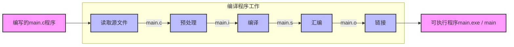

## 安装编译程序

> 编译程序是用来
> 将人类所写的可读程序 编译成（翻译成）计算机能够理解并执行的二进制程序




## 写一个程序

1. 创建一个新文件，将其文件名命名为`main.c`

> 注意⚠️ 一些 Windows 会默认隐藏后缀，须自行打开显示后缀
> 否则可能会命名为`main.c.txt`，`.txt`被隐藏

2. 任选一个编辑器，手动键入如下代码并*保存*（**键盘英文模式**）

```c
#include <stdio.h>
int main(){
    printf("Hello World!\n");
  	return 0;
}
```

3. 编译成可执行文件

使用任何你喜欢的方式来将`main.c`编译，如GCC，VSCode run code等
```bash
gcc main.c -o main
```
该方式将`main.c`中人类可理解的字符的内容，翻译成机器可执行的二进制机器码，并在同级目录产生一个可执行程序

4. 执行测试

在使用代码编辑器运行，会直接隐藏可执行程序，默认直接执行，而通过gcc编译则须手动点击或使用命令行

```bash
./main
```

🎉🎉🎉

这样就成功完成了对第一个C程序的编写、编译、执行。


<hr>


<ul>
  <li>
    <input type="checkbox" id="task1" name="task1" checked><label for="task1">  尝试理解上述编译的过程</label>
  </li>
  <br />
  <li>
    <input type="checkbox" id="task1" name="task2"><label for="task2">  为什么在命令行，机器能理解我输入的编译命令：<code>gcc main.c -o main</code></label>
  </li>
  <br />
  <li>
    <input type="checkbox" id="task1" name="task3"><label for="task3">  编译器是如何做到解析人类写的代码并转译成可执行的程序的？</label>
	</li>
</ul>


