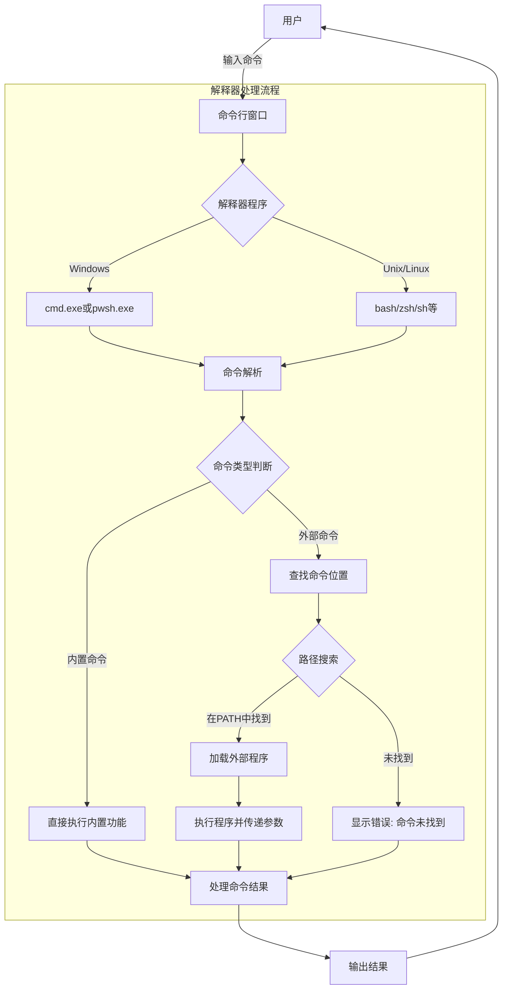
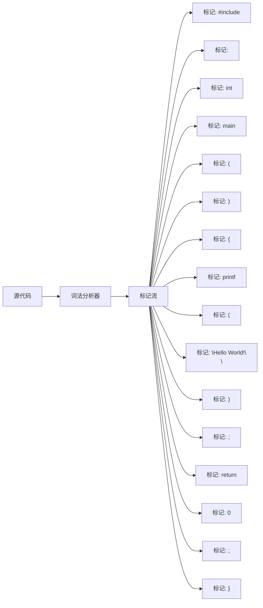
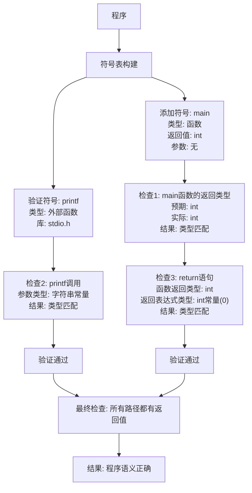
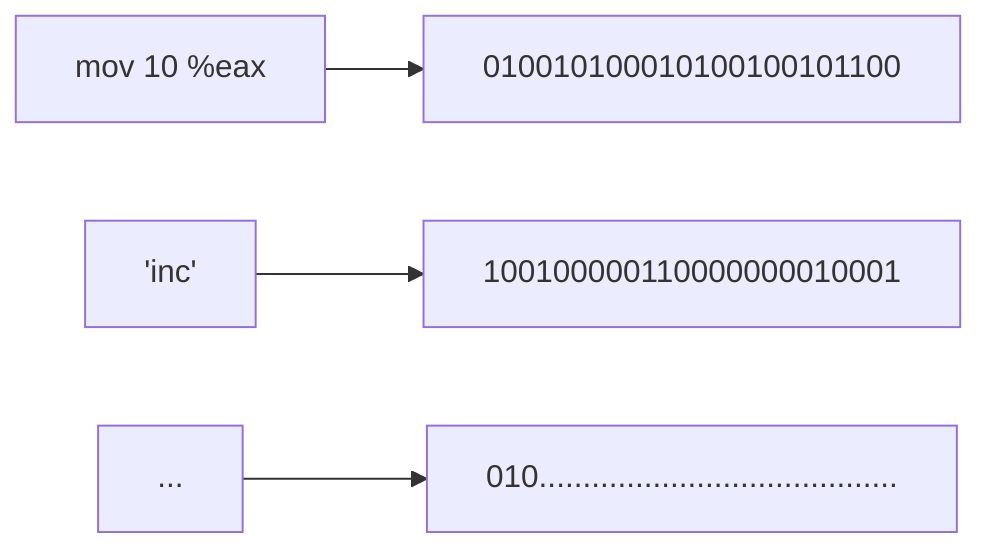
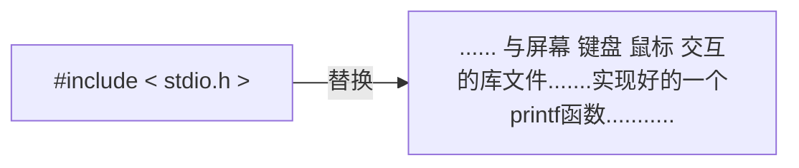

## 解我之惑

### 解释器

当打开cmd、powershell窗口或使用类Unix终端时，背后实际运行了一个cmd.exe/pwsh.exe/shell解释程序。

它负责接受给定的输入命令及参数，根据内置或下载的二进制程序，查询命令的存在性（合法性），执行相应的二进制程序并响应输出。

这个过程看似是连续的、不间断的，但机器并不是在接收到你的命令后连续地执行的，机器可能还并发（在极短时间内、ms级切换）的执行图形界面渲染等程序。

因此命令行程序能理解并执行输入的`gcc main.c -o main`

### 编译器

编译程序并不能理解人类较为自然的编程语言，它只是通过预先设置的规则，根据C语言的关键字、标识符、运算符等，对所写程序源码进行处理转为一种标记序列。对标记序列进行词法分析：

语法分析：

语义分析：

再将语法分析结果转化成一种中间代码，方便在编译阶段接受优化参数对源码进行编译优化。

最终将优化后的中间代码转换为汇编代码（或特定平台机器码）。

而汇编代码 与 可执行的机器码是一一对应的，即一条汇编代码直接对应一串二进制序列

最后，通过链接程序，将生成的汇编代码与引入的库文件合并，生成最终可执行程序。

## 逐行解析

### 导入库

1. #### `#include <stdio.h>`

在C语言中，通过井号`#`作为特定的标记，与代码实现部分（`void main`或`printf(...)`）明显不同。

在这里，`#include`所做的操作，就是将后面跟的库，原封不动的**“复制粘贴”**到此程序。

可以看到，我们导入了一个stdio.h文件即标准输入输出（STanDard I/O），由于使用了其标准输入输出库文件中的一个函数`printf()`作为展示结果到命令窗口。

这里的`.h`表明这是一个头文件(header)，C语言允许你通过头文件的方式，将一些声明与具体实现分离，可在头文件中仅做声明，在`.c`文件中再具体实现。

2. #### `int main(){}`

在C/C++中`main(){}`的形式是整个程序的入口，也是整个程序执行真正开始的地方。其前方的`int`是一个关键字，含义为*整型数字*，它指明了，最终执行完`{}`中所有的内容后，将要返回给操作系统什么样的值，操作系统默认期望值为`0`以标志正确执行成功。

从此可以看出`{}`是一个函数或其他结构的边界线，它编译时在语法分析中被单独切开作为标记，在后续的编译中两两配对。

3. #### `printf("Hello World!\n");`

在这一行，我们使用了库中的一个与屏幕交互的预定义函数，其含义为将`printf()`括号内的内容按照要求输出到屏幕上。在这里可以看到，字符`\n`似乎没有在屏幕中显示，实际上，`\n`是对格式的一种要求的特定转义字符，它的作用是，当输出到此处是换行。类似的还有如下表，这些转义序列在C/C++程序中被编译器特殊处理，不会按字面值输出，而是执行相应的控制功能或显示特殊字符

| 转义序列 | 名称         | 描述                                   |
| -------- | ------------ | -------------------------------------- |
| `\n`     | 换行符       | 将光标移到下一行开头                   |
| `\t`     | 水平制表符   | 将光标移到下一个制表位置               |
| `\r`     | 回车符       | 将光标移到当前行开头                   |
| `\\`     | 反斜杠       | 表示一个反斜杠字符                     |
| `\"`     | 双引号       | 表示一个双引号字符                     |
| `\'`     | 单引号       | 表示一个单引号字符                     |
| `\0`     | 空字符(null) | 字符串结束标记                         |
| `\a`     | 警报(alert)  | 发出系统提示音                         |
| `\b`     | 退格符       | 将光标向左移动一个位置                 |
| `\f`     | 换页符       | 将光标移到下一页开头                   |
| `\v`     | 垂直制表符   | 在文本中垂直移动光标                   |
| `\xhh`   | 十六进制值   | 表示ASCII码为十六进制值hh的字符        |
| `\ooo`   | 八进制值     | 表示ASCII码为八进制值ooo的字符         |
| `\?`     | 问号         | 表示一个问号(在某些情况下避免三字符组) |

4. #### `return 0;`

`return`作为一个关键字，将其后面的内容作为结果返回到函数外，它可以返回多种类型的数据，包括`int, float , double`等

## 数据类型

### 基本数据类型

| 类型       | 关键字   | 描述                         | 典型大小    | 值范围                    |
| ---------- | -------- | ---------------------------- | ----------- | ------------------------- |
| 字符       | `char`   | 用于表示字符，也可作为小整数 | 1字节       | -128到127或0到255         |
| 整型       | `int`    | 基本整数类型                 | 4字节(通常) | -2^31到2^31-1             |
| 浮点型     | `float`  | 单精度浮点数                 | 4字节       | 约±3.4E±38 (6-7位精度)    |
| 双精度浮点 | `double` | 双精度浮点数                 | 8字节       | 约±1.7E±308 (15-16位精度) |
| 无值       | `void`   | 表示没有值                   | -           | -                         |

### 整数类型修饰符

| 修饰符      | 应用于 | 描述                                |
| ----------- | ------ | ----------------------------------- |
| `signed`    | 整型   | 表示可以存储负值(默认)              |
| `unsigned`  | 整型   | 只存储零和正值，扩大正值范围        |
| `short`     | `int`  | 较小范围整数类型 (通常2字节)        |
| `long`      | `int`  | 较大范围整数类型 (通常4字节或8字节) |
| `long long` | `int`  | 更大范围整数类型 (通常8字节)        |

### 常见的组合类型

| 组合类型             | 描述              | 典型大小                |
| -------------------- | ----------------- | ----------------------- |
| `unsigned char`      | 字节数据，ASCII值 | 1字节 (0到255)          |
| `unsigned int`       | 非负整数          | 4字节 (0到$2^{32}-1$)   |
| `short int`          | 短整数            | 2字节 (-32,768到32,767) |
| `unsigned short int` | 非负短整数        | 2字节 (0到65,535)       |
| `long int`           | 长整数            | 4或8字节                |
| `unsigned long int`  | 非负长整数        | 4或8字节                |
| `long long int`      | 更长整数          | 8字节                   |
| `long double`        | 扩展精度浮点数    | 8或16字节               |

### 派生数据类型

| 类型   | 描述                   | 声明例子             |
| ------ | ---------------------- | -------------------- |
| 数组   | 同类型元素的集合       | `int numbers[10];`   |
| 指针   | 存储内存地址           | `int *ptr;`          |
| 结构体 | 不同类型元素的组合     | `struct {...} name;` |
| 联合   | 共享内存的不同数据类型 | `union {...} name;`  |
| 枚举   | 整型常量的集合         | `enum {...} name;`   |

### 类型限定符

| 限定符     | 描述                              |
| ---------- | --------------------------------- |
| `const`    | 声明不可修改的变量                |
| `volatile` | 告诉编译器变量可能被外部改变      |
| `restrict` | 指示指针是访问对象的唯一方式(C99) |

注：**具体类型的大小和范围可能因编译器和系统而异**
