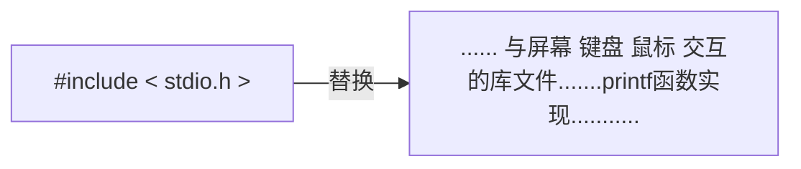
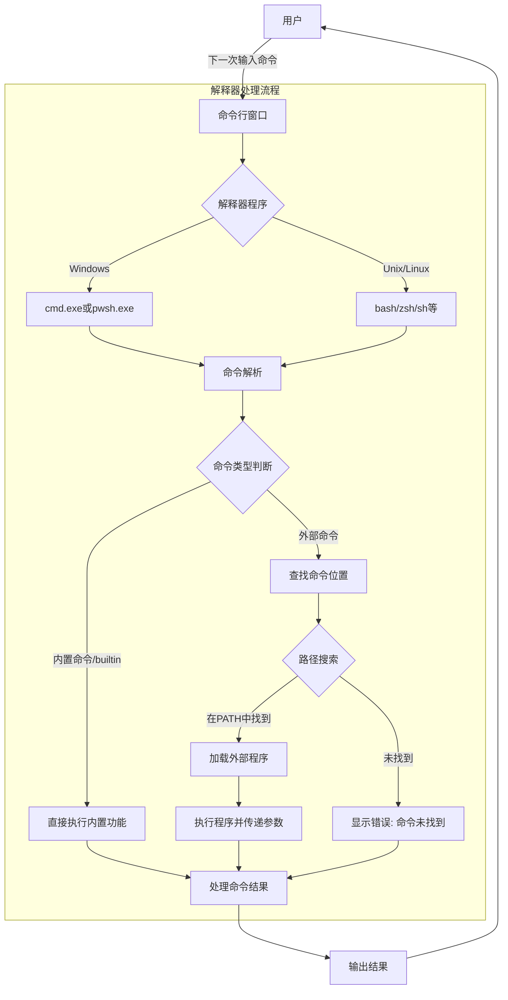
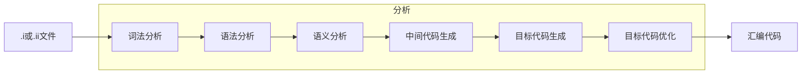
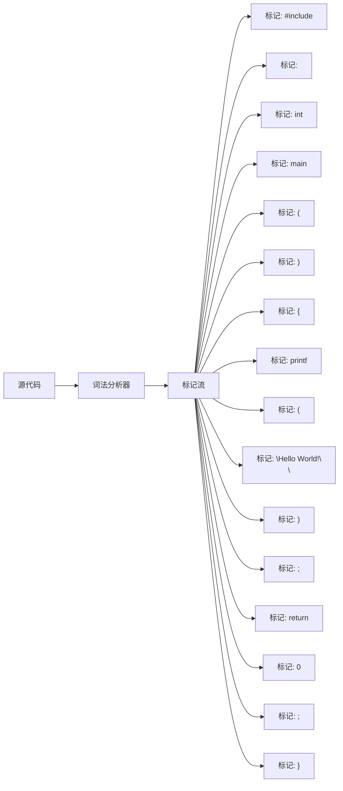
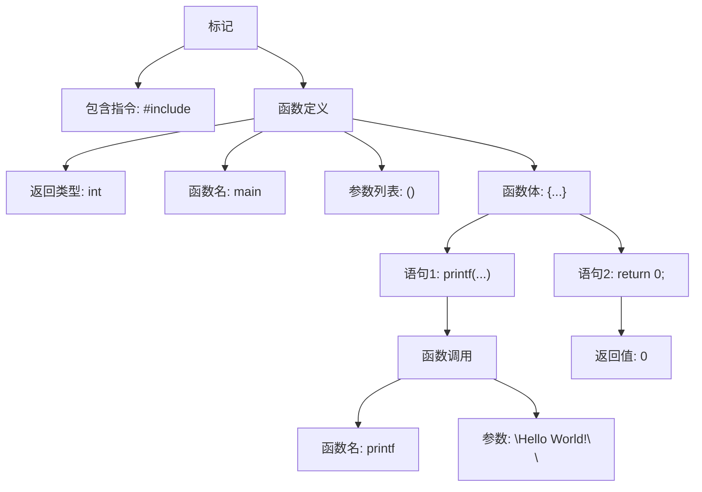
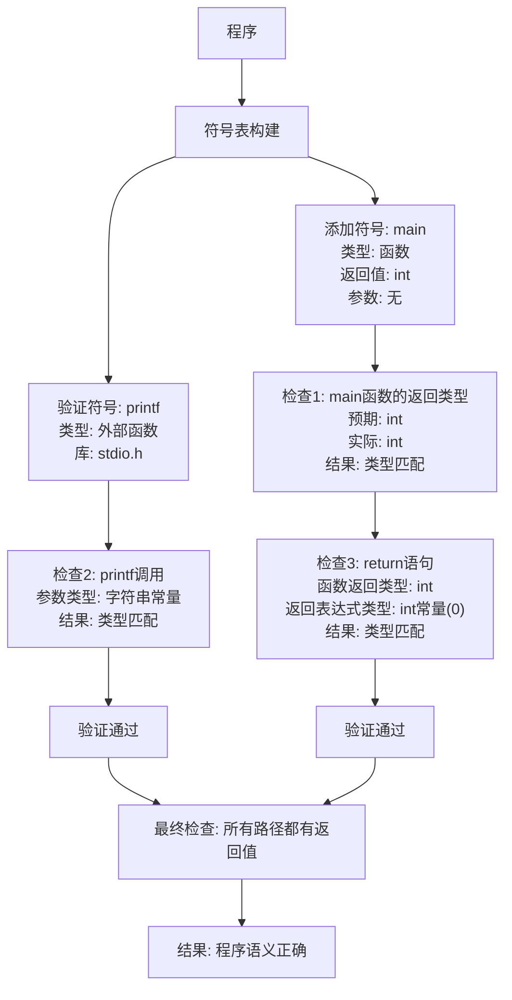
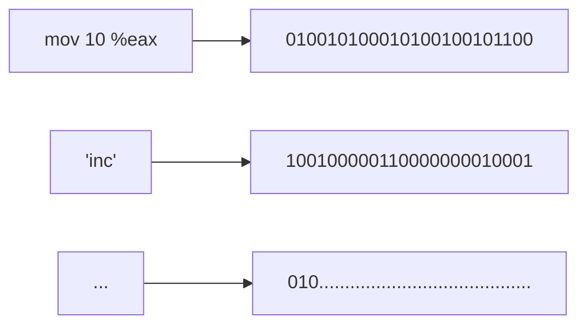

## 逐行解析

1.  `#include <stdio.h>`

在C语言中，通过井号`#`作为特定的标记，与代码实现部分（`void main`或`printf(...)`）明显不同。

在这里，`#include`所做的操作，就是将后面跟的库，原封不动的**“复制粘贴”**到此程序。

可以看到，我们导入了一个stdio.h文件即标准输入输出（STanDard I/O），由于使用了其标准输入输出库文件中的一个函数`printf()`作为展示结果到命令窗口。



这里的`.h`表明这是一个头文件(header)，C语言允许你通过头文件的方式，将一些声明与具体实现分离，可在头文件中仅做声明，在`.c`文件中再具体实现。

2.  `int main(){}`

在C/C++中`main(){}`的形式是整个程序的入口（这表明它是每个C程序必须的函数），也是整个程序执行真正开始的地方。其前方的`int`是一个关键字，含义为*整型数字*，它指明了，最终执行完`{}`中所有的内容后，将要返回给操作系统什么样的值，操作系统默认期望值为`0`以标志正确执行成功。

从此可以看出`{}`是一个函数或其他结构的边界线，它编译时在语法分析中被单独切开作为标记，在后续的编译中两两配对；而`()`中填入该函数可以接受的输入参数。

3.  `printf("Hello World!\n");`

在这一行，我们使用了库中的一个与屏幕交互的预定义函数，其含义为将`printf()`括号内的内容按照要求输出到屏幕上。在这里可以看到，字符`\n`似乎没有在屏幕中显示，实际上，`\n`是对格式的一种要求的特定转义字符，它的作用是，当输出到此处是换行。

类似的还有如下表，这些转义序列在C/C++程序中被编译器特殊处理，不会按字面值输出，而是执行相应的控制功能或显示特殊字符

| 转义序列 | 名称         | 描述                                   |
| -------- | ------------ | -------------------------------------- |
| `\n`     | 换行符       | 将光标移到下一行开头                   |
| `\t`     | 水平制表符   | 将光标移到下一个制表位置               |
| `\r`     | 回车符       | 将光标移到当前行开头                   |
| `\\`     | 反斜杠       | 表示一个反斜杠字符                     |
| `\"`     | 双引号       | 表示一个双引号字符                     |
| `\'`     | 单引号       | 表示一个单引号字符                     |
| `\0`     | 空字符(null) | 字符串结束标记                         |
| `\a`     | 警报(alert)  | 发出系统提示音                         |
| `\b`     | 退格符       | 将光标向左移动一个位置                 |
| `\f`     | 换页符       | 将光标移到下一页开头                   |
| `\v`     | 垂直制表符   | 在文本中垂直移动光标                   |
| `\xhh`   | 十六进制值   | 表示ASCII码为十六进制值hh的字符        |
| `\ooo`   | 八进制值     | 表示ASCII码为八进制值ooo的字符         |
| `\?`     | 问号         | 表示一个问号(在某些情况下避免三字符组) |

可以轻易看出，`\`负责将某一种字符转化成另一种含义，即`\`为转义字符。这种方式在许多编程语言是通用的。

例如，在一些shell解释器中，想要输出某些特定字符，必须进行转义，因为这些字符在解释器中被定义为一些操作或对象：

```bash
# 这二者的输出是不一样的
echo $0
echo \$0
```


4. `return 0;`

`return`作为一个关键字，将其后面的内容作为结果返回到函数外，它可以返回多种类型的数据，包括`int, float , double`（整数、浮点数）等

<hr>

## 程序执行的背后

### 解释器

当打开cmd、powershell窗口或使用类Unix终端时，背后实际运行了一个cmd.exe/pwsh.exe/shell解释程序。

它负责接受给定的输入命令及参数，根据内置或下载的二进制程序，查询命令的存在性（合法性），执行相应的二进制程序并响应输出。




这个过程看似是连续的、不间断的，但机器并不是在接收到你的命令后连续地执行的，机器可能还并发（在极短时间内、ms级切换）的执行图形界面渲染等程序。


因此，其能理解并执行输入的`gcc main.c -o main`命令


### 编译过程

 gcc把预编译和编译合并为一个步骤，对于C使用***cc1***指令完成，C++则使用***cc1plus***，gcc是对后台程序的包装，其根据不同参数调用cc1、as、ld（预编译、汇编、链接）

#### 预编译

主要处理所有以`#`开头的预编译指令，并生成行号和文件标识，删除所有注释、`/**/`和`//`

- 删除所有的`#define`，并展开所有的**宏定义**
- 处理所有条件编译指令，如`#if`、`#ifdef`、`#endif`、`#elif`和`#else`
- 处理`#include`预编译指令，将文件替换到其位置，该过程是递归进行的
- 保留所有的`#progma`编译器指令，编译器需要用到他们，例如`#pragma once`防止重复引用等等
- 删除所有注释、`/**/`和`//`
- 添加行号和文件标识，便于编译时编译器产生调试用的行号信息，和编译时产生编译错误或警告时能够显示行号，快速排错。

> C/C++的宏替换和文件包含工作交由单独的预处理器，而不归入编译器范围
>
> - C语言中源代码文件扩展名为`.c`，头文件扩展名为`.h`，经过预编译后生成`.i`文件
> - C++中源码文件扩展名为`.cc`、`.cpp`、`.cxx`等，头文件扩展名为`.hpp`等，经预编译后生成的则是`.ii`文件

#### 编译

将预编译后产生的`.i`，`.ii`文件进行一系列处理后，生成汇编代码




##### 词法分析

利用类似于***有限状态机***的算法，将源码程序输入到扫描机中，将其中的**字符序列划分成一系列标记（记号）**



词法分析产生的**标记分类**包含：关键字、标识符、字面量（数字、字符串）、特殊符号（加号、等号等等）

##### 语法分析

语法分析器对词法分析器产生的标记，进行语法分析，产生语法树，如下。



与此同时，运算符优先级就确定了下来，如果表达式出现不合法（括号不匹配、表达式缺少操作等），编译器就会报错并返回相应报错信息，即只完成对表达式**语法层面**分析。


##### 语义分析

对**表达式是否有意义**的判断，分析的是静态语义（编译时即可分析）。相应的动态语义需要在运行期才能确定。

静态语义通常包括：**声明和类型的匹配，类型的转换**。例如：不合法的类型转换或赋值就由语义分析器检出。




##### 中间代码生成及优化

这里的优化是源代码级别的一个优化过程，源码优化器会将整个语法树转换为中间代码（语法树的顺序表示），十分接近目标代码，而优化就是将语法树的可优化的子树替换为一个优化后的节点。

中间代码具有多种类型，最常见的是**“三地址码”**和**“P-代码”**

- 三地址码：`c = a op b`，（op表示操作）

> 中间代码使得编译器可以被划分为前端和后端
>
> - 编译器前端负责产生与机器无关的中间代码
> - 编译器后端将中间代码转换为机器代码
>
> 源代码优化器产生中间代码，标志着其后的过程都属于编译器后端，编译器后端主要包括：代码生成器和目标代码优化器

##### 目标代码生成

由代码生成器将中间代码转化为目标机器代码，生成一系列的代码序列（汇编语言表示）

##### 目标代码优化

对上述的目标机器代码进行优化，寻找合适的寻址方式、使用移位代替乘法运算、删除多余指令等


#### 汇编

汇编代码与机器指令是一一对应的，如下，通过as将汇编码一一翻译成机器码，产生`.o`或`.obj`文件

但，变量和数组等类似二次寻址的操作的地址仍没有确定，因此需要链接器将其构建成一个完整程序。



#### 链接

链接程序ld 将生成的汇编代码与引入的库文件合并，生成最终可执行程序。

