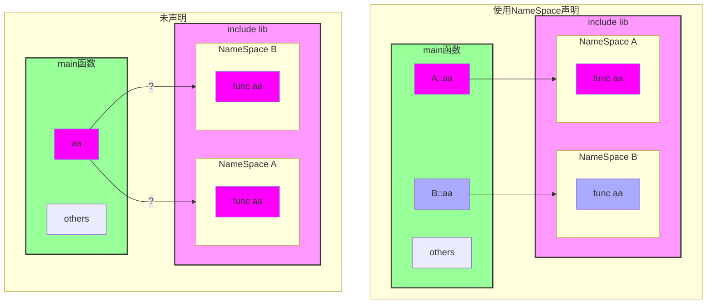

##  第一个C++程序

> 在之前的两文中，你已经理解了，C程序是如何编写、编译、执行的，C++作为其衍生和扩展，自然有与之不同的地方，但基本相似

与C语言相似的，C++也封装了一个输入输出库`iostream`，并使用**命名空间（NameSpace）**来隔绝于开发者的自行函数封装

```cpp
// C
// #include <stdio.h>

// C++
#include <iostream>
using namespace std; // 该行也可不写，但要在后续使用时，以std::func的方式显式地指明该函数来自命名空间std
int main(void){
  cout<<"Hello World"<<endl;
  // std::cout<<"Hello World"<<std::endl; //显式地指明
}
```

#### Token与代码规范

> 填坑中 << EOF

#### 命名空间

命名空间（NameSpace）是一种隔离不同开发者开发重名函数诞生的作用域声明。它将同一重名的函数区分在不同的命名空间下，从而防止在引用时出现错误。



在上述的程序中即使用了命名空间`std`中的`cout`函数和`endl`函数，以输出字符和换行，准确的说是将字符流和换行插入到输出流中。


