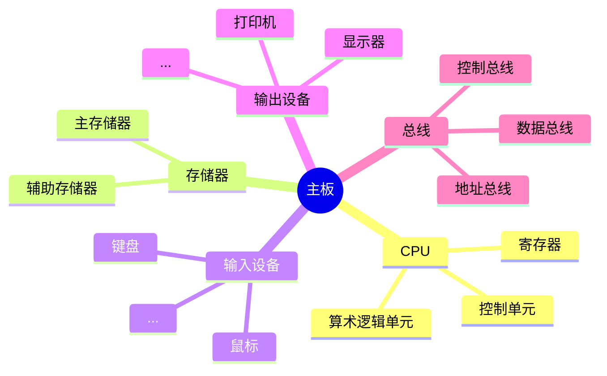

## 计算机的结构和发展

#### 计算机的发展历程

1. **早期机械计算器（17世纪-19世纪）**
   - 1614年，苏格兰数学家纳皮尔发明了对数表。
   - 1623年，德国科学家威廉·希卡德建造了世界上第一台机械计算器。
   - 1642年，法国数学家帕斯卡发明了滚轮式加法器。

2. **打孔卡片时代（19世纪-20世纪初）**
   - 1801年，法国人雅卡尔发明了提花织布机，使用打孔卡片控制织花图样。
   - 1890年，美国统计学家赫尔曼·何乐礼发明了制表机，利用打孔卡片进行数据处理。

3. **早期电子计算机（20世纪40年代-50年代）**
   - 1941年，德国科学家楚泽发明了Z3计算机。
   - 1943年，英国发明了巨像计算机，用于破解德国的密码。
   - 1946年，美国发明了ENIAC计算机，被认为是第一台通用电子计算机。

4. **晶体管计算机（20世纪50年代-60年代）**
   - 1955年，曼彻斯特大学建造了第一台晶体管计算机。
   - 1960年，CDC 6600超级计算机问世，被认为是第一台超级计算机。

5. **集成电路和微处理器时代（20世纪70年代-至今）**
   - 1971年，英特尔发布了第一款微处理器4004。
   - 1981年，IBM发布了第一台个人电脑（PC）。
   - 21世纪，计算机技术迅速发展，进入云计算和人工智能时代。

#### 计算机的基本结构

##### 冯诺伊曼机结构

##### 现代计算机结构

现代计算机的发展趋势是以存储为核心，这主要体现在以下几个方面：

1. **大容量存储器**
   - 现代计算机配备了大容量的主存储器和辅助存储器，以满足数据密集型应用的需求。

2. **高速缓存**
   - 现代计算机使用多级缓存（L1、L2、L3）来提高数据访问速度，减少CPU等待时间。

3. **存储器层次结构**
   - 现代计算机采用存储器层次结构，从高速缓存到主存储器，再到辅助存储器，形成一个高效的数据存储和访问体系。

4. **非易失性存储器**
   - 现代计算机逐渐采用非易失性存储器（如SSD）替代传统的机械硬盘，提高数据存储的可靠性和速度。
