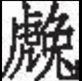

<h1 class="article-title"> 兔罝 </h1>

肃肃兔罝<a href="#1" class="article-link">[1]</a>， 椓之丁丁<a href="#2" class="article-link">[2]</a>。

赳赳武夫<a href="#3" class="article-link">[3]</a>，公侯干城<a href="#4" class="article-link">[4]</a>。

 

肃肃兔罝， 施于中逵<a href="#5" class="article-link">[5]</a>。

赳赳武夫，公侯好仇<a href="#6" class="article-link">[6]</a>。

 

肃肃兔罝， 施于中林<a href="#7" class="article-link"> [7] </a>。

赳赳武夫，公侯腹心<a href="#8" class="article-link">[8]</a>。

 

<h6> 注释 </h6>

<a id="1">[1]</a> 肃肃（suō）：兔网细密整齐的样子。兔罝（jū）：兔网。一说“兔”同“ ”，即捕虎之网。总之，是捕野兽的网。

<a id="2">[2]</a> 椓（zhuó）：捶打，这里指打木橛以固定兽网。丁丁：捶打声。

<a id="3">[3]</a> 健壮威武的样子。武夫：武士。

<a id="4">[4]</a> 公侯：周代统治者分五等爵位，即公、侯、伯、子、男。干：盾。城：即城墙。干、城，都用来防卫。

<a id="5">[5]</a> 施：设置。中逵：即“逵中”，指纵横交叉的路口。

<a id="6">[6]</a> 好仇（qiú）：好助手，好朋友。仇，同“逑”，匹配的意思。

<a id="7">[7]</a> 中林：即“林中”，指密林深处。

<a id="8">[8]</a> 腹心：亲信，心腹之人。
