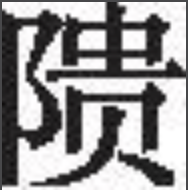

<h1 class="article-title"> 苍耳 </h1>

采采苍耳<a href="#1" class="article-link">[1]</a>， 不盈顷筐<a href="#2" class="article-link">[2]</a>。

嗟我怀人<a href="#3" class="article-link">[3]</a>， 寘彼周行<a href="#4" class="article-link">[4]</a>。

陟彼崔嵬<a href="#5" class="article-link">[5]</a>， 我马虺<a href="#6" class="article-link">[6]</a>。

我姑酌彼金罍<a href="#7" class="article-link">[7]</a>，维一不永怀<a href="#8" class="article-link">[8]</a>。

陟彼高冈， 我马玄黄<a href="#9" class="article-link">[9]</a>。

我姑酌彼兕觥<a href="#10" class="article-link">[10]</a>，维以不永伤。

陟彼砠矣<a href="#11" class="article-link">[11]</a>，我马瘏矣<a href="#12" class="article-link">[12]</a>。

我仆痡矣<a href="#13" class="article-link">[13]</a>，云何吁矣<a href="#14" class="article-link">[14]</a>。

 

<h6> 注释 </h6>

<a id="1">[1]</a> 卷耳：一种植物，又名苍耳，可食用，也可药用。

<a id="2">[2]</a> 顷筐：形如簸箕的浅筐。

<a id="3">[3]</a> 嗟（jiē）：语助词。怀人：想念的人。

<a id="4">[4]</a> 寘：同“置”，放置。彼：指顷筐。周行（hánɡ）：大路。 

<a id="5">[5]</a> 陟（zhì）：登上。崔嵬（wéi）：高而不平的土石山。

<a id="6">[6]</a> 虺（huī tuí）：因疲劳而病。 

<a id="7">[7]</a> 姑：姑且。酌：斟酒。此处也指饮酒。金罍（léi）：青铜铸的酒器。

<a id="8">[8]</a> 维：语助词。永怀：长久地思念。 

<a id="9">[9]</a> 玄黄：马因病毛色焦枯。

<a id="10">[10]</a> 兕觥（sì ɡōnɡ）：牛角制的酒杯。

<a id="11">[11]</a> 砠（jū）：戴土的石山。

<a id="12">[12]</a> 瘏（tú）：病。

<a id="13">[13]</a> 痡（pū）：过度疲劳不能行之病。

<a id="14">[14]</a> 云：语助词。何：何等，多么。吁（xū）：忧愁。
