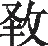

<h1>葛覃</h1>

葛之覃兮<a href="#1">[1]</a>,施于中谷<a href="#2">[2]</a>,维叶萋萋<a href="#3">[3]</a>。

黄鸟于飞<a href="#4">[4]</a>,集于灌木<a href="#5">[5]</a>,其鸣喈喈<a href="#6">[6]</a>。

葛之覃兮<a href="#7">[7]</a>,施于中谷<a href="#8">[8]</a>,维叶莫莫<a href="#9">[9]</a>。

是刈是濩<a href="#10">[2]</a>,为𫄨为绤<a href="#11">[11]</a>服之无 <a href="#12">[12]</a>。

言告师氏<a href="#13">[13]</a>,言告言归<a href="#14">[14]</a>。

薄污我私<a href="#15">[15]</a>,薄浣我衣<a href="#16">[16]</a>。

害浣害否<a href="#17">[17]</a>,归宁父母<a href="#18">[18]</a>。

<h6>注释</h6>

<a id="1">[1]</a> 葛：藤本植物，茎的纤维可织成葛布。覃：蔓延。

<a id="2">[2]</a> 施（yì）：延及。中谷：即“谷中”。

<a id="3">[3]</a> 维：发语词。萋萋：茂盛的样子。

<a id="4">[4]</a> 黄鸟：黄雀，又称黄栗留，身体很小。于：语助词。 

<a id="5">[5]</a> 集：聚集。

<a id="6">[6]</a> 喈喈：鸟鸣声。 

<a id="7">[7]</a> 莫莫：茂密的样子。

<a id="8">[8]</a> 是：乃。刈（yì）：割。濩（huò）：煮。 

<a id="9">[9]</a> 𫄨（chī）：细葛布。绤（xì）：粗葛布。

<a id="10">[10]</a> 服：穿。无 （yì）：不厌倦。

<a id="11">[11]</a> 言：连词，于是。一说发语词。师氏：保姆。一说女师。

<a id="12">[12]</a>告：告假。归：回娘家。

<a id="13">[13]</a> 薄：句首助词。污：洗去污垢。私：内衣。

<a id="14">[14]</a> 浣（huàn）：洗。衣：指外衣。

<a id="15">[15]</a> 害：何。

<a id="16">[16]</a> 归宁：出嫁女子回娘家探视父母。 
