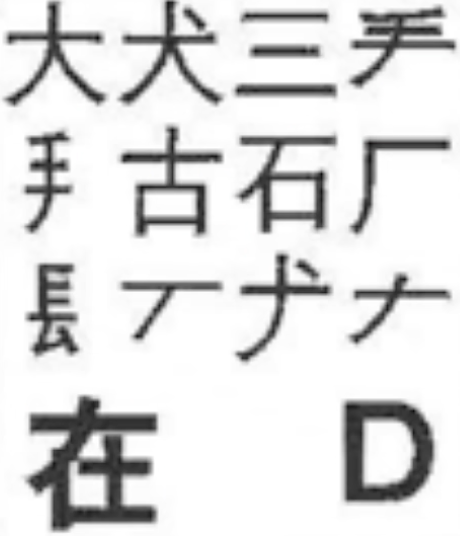

## 五笔输入法

> 开坑

通过中文字符的结构作为编码

提高中文输入效率（ 4 码成词）

#### 字根

字根**一般**是汉字的偏旁部首

横、竖、撇、捺、折

横：GFDSA（11F 12F 13D 14S 15A）

竖：HJKLM（21H 22J 23K 24L 25M）

撇：TREWQ （31T 32R 33E 34W 35Q）

捺：YUIOP （41Y 42U 43I 44O 45P）

折：NBVCX （51N 52B 53V 54C 55X）

##### 横区

###### 11G

王旁 青头 戋 五一

一级简码：一

###### 12F

土士二干十寸雨

一级简码：地

###### 13D

大犬三羊古石厂

一级简码：在

###### 14S

木丁西

一级简码：要

###### 15A

工 戈 草头 右框 七

一级简码：工

 

->>>>>>>>>>>>>>>>>>>>>>>>>